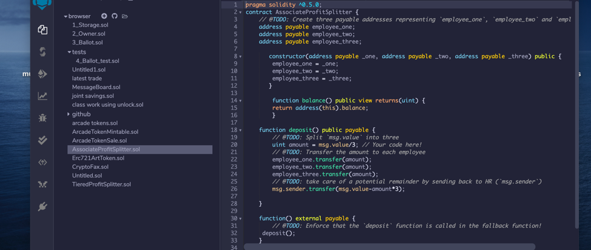
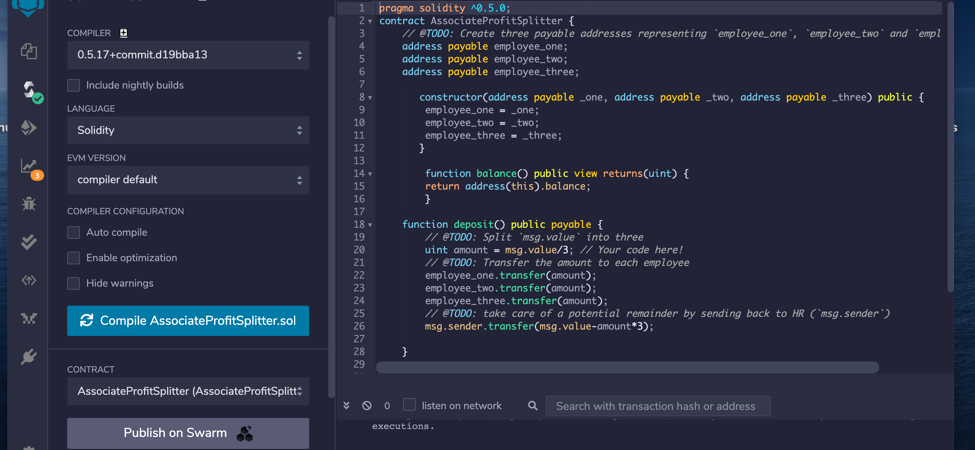
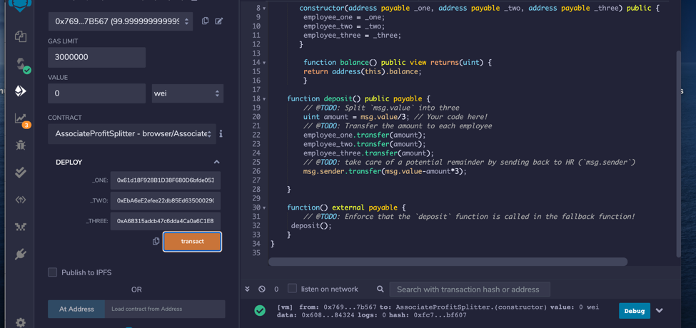
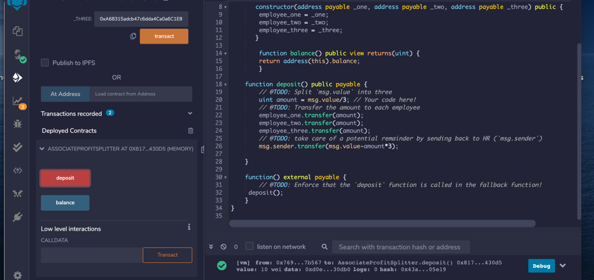
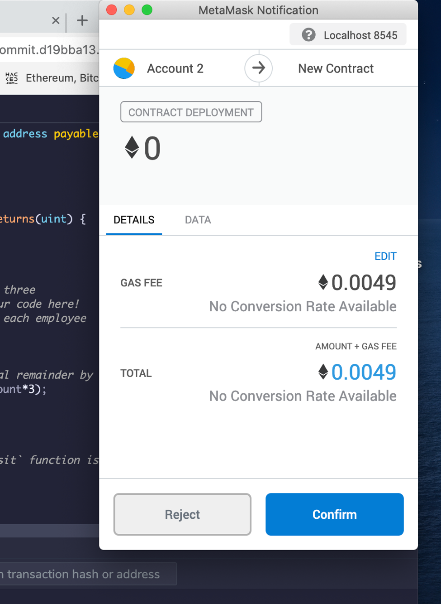
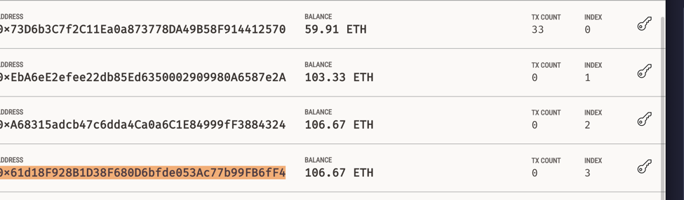

### Smart contract code for AssociateProfitSplitter.sol.

### The amount in addresses that represent `employee_one`, `employee_two`, and `employee_three` before deployment of transaction.

### The smart contract AssociateProfitSplitter.sol is compiled. 

.png)

### The smart contract is deployed.

### The smart contract executes a deposit.

### The Transaction is reflected in MetaMask.

.png)

### The transaction amounts are reflected in the ledger.

